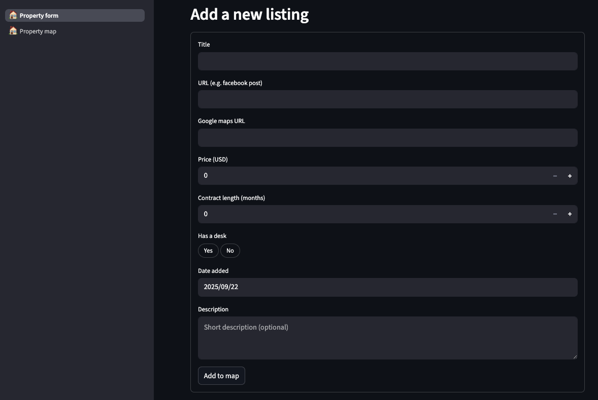
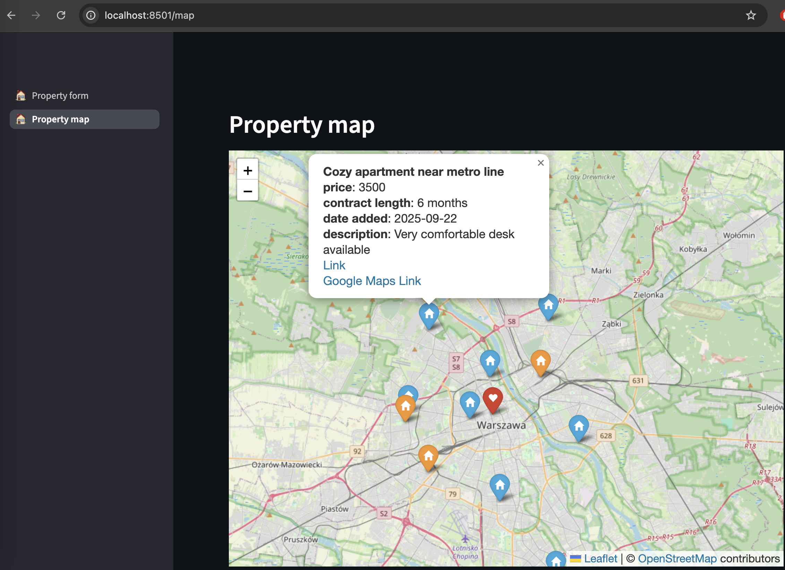

### Overview

The app was created as a helper tool in a process of finding an apartment to rent, which often can be a quite mundane endeavour. Depending on the website used to find the apartments, keeping a track of all the potential apartments might be hard if there's no map available by default, so that tool aims to facilitate that problem by allowing to save any listings and display them on the map.

## Project Evolution

The initial version of the app has fulfilled its role of a personal project, solving real problems, but as there could be more people facing exactly the same issues in their apartment hunt, the project became a part of a larger evolution story:

1. **[property-map](https://github.com/PrzemyslawKepka/property-map)** (this repo) - General-purpose tool with form input, can be adapted to any city
2. **[cm-rentals-streamlit](https://github.com/PrzemyslawKepka/cm-rentals-streamlit)** - First public version, for the city of Chiang Mai, direct extension of this repo (deployed as backup)
3. **[cm-rentals-flask](https://github.com/PrzemyslawKepka/cm-rentals-flask)** - App overhaul, migrated to Flask (production version)

**Read more:** Blog post about the evolution (coming soon!)

## Features

- **Save apartment listings via a simple form**



- **Visualize saved listings on an interactive map**



- Form-based property input (title, price, location, amenities)
- Interactive map display using Folium
- Automatic coordinate extraction from Google Maps URLs
- Supabase backend for persistent storage
- Customizable for different cities and use cases

## Use Cases

- Monthly rental hunting (original purpose)
- Property investment tracking
- Real estate comparison
- Any location-based item tracking

## Tech Stack

- **Frontend:** Streamlit for UI and page navigation
- **Backend:** Supabase (PostgreSQL + API) for persistence
- **Maps:** Folium for map rendering
- **Language:** Python 3.11

## Setup & Installation

### Prerequisites

- Python 3.11 installed
- A Supabase instance with the required schema (see Data Storage section)

### Installation Steps

1. Clone the repository

```bash
git clone https://github.com/PrzemyslawKepka/property-map
cd property-map
```

2. Create virtual environment

```bash
python3 -m venv venv
source venv/bin/activate  # On Windows: venv\Scripts\activate
```

3. Install dependencies

```bash
pip install -r requirements.txt
```

4. Set up environment variables

```bash
cp .env.example .env
# Edit .env with your Supabase credentials
```

5. Run the application

```bash
streamlit run app.py
```

## Environment Variables

See [.env.example](.env.example) for required environment variables.

| Variable | Description | Required |
|----------|-------------|----------|
| `SUPABASE_URL` | Your Supabase project URL | Yes |
| `SUPABASE_KEY` | Supabase anon or service key | Yes |

## Data Storage

The app uses Supabase for persistence and relies on two tables:

- **Main listings table:** Stores all properties added via the form page. All rows in this table are shown on the map.
- **Default location table:** Stores a single "home" or reference location used as the map's starting point. It is rendered with a different icon (currently a heart). This table is managed manually in Supabase and is optional.

Configure the schema and exact table names in [property_map/db.py](property_map/db.py) via `SCHEMA`, `DATA_TABLE`, and `DEFAULT_LOCATION_TABLE` variables.

## App Usage

### Pages

- **Property form:** Add a new listing by pasting a listing URL and a Google Maps URL. Coordinates are extracted automatically from the Google Maps URL.
- **Property map:** Browse all saved listings on a Folium map. Clicking a marker shows a popup with details and links.

### Adding a Listing

- Provide title, price, contract length (months), desk availability (Yes/No), date added, and an optional description
- Paste a Google Maps URL - the app supports patterns like `!3d<lat>!4d<lon>` and `@<lat>,<lon>`
- Submit to save the listing to Supabase

## Contributing

The app can be freely forked and customized to any needs, but thise core version can of course be updated as well, hence suggestions and bug reports are welcome via GitHub Issues.

## License

MIT License - See [LICENSE](LICENSE) file for details

## Author

Built by Przemysław Kępka

- GitHub: [@PrzemyslawKepka](https://github.com/PrzemyslawKepka)
- Portfolio: [pk-data-solutions.com](https://pk-data-solutions.com) (coming soon)
